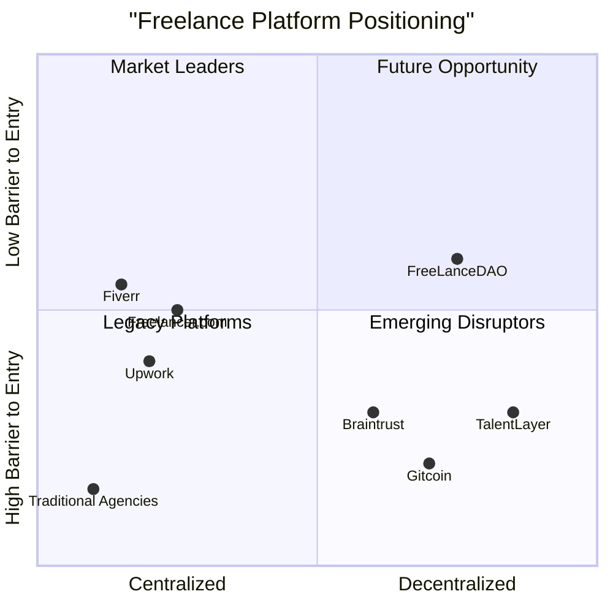

# FreeLanceDAO - Product Requirements Document (PRD)

## 1. Introduction

### 1.1 Project Overview
FreeLanceDAO is a decentralized freelance platform that combines Web2 familiarity with Web3 automation and governance. It aims to create a trustless environment where clients and freelancers can collaborate efficiently with smart contract-based escrow systems and decentralized governance.

### 1.2 Original Requirements
Build a decentralized freelance platform using Next.js and Tailwind CSS with a nice blue color palette, optimized for mobile devices. The MVP should include user authentication, profile management, job posting, escrow payments, messaging, admin controls, reputation system, hybrid Web2/Web3 onboarding, and user dashboards.

### 1.3 Programming Stack
- **Frontend**: Next.js, React, Tailwind CSS
- **Backend**: Node.js (or compatible with Next.js backend)
- **Blockchain**: Hadera Hashgraph
- **Database**: MongoDB or PostgreSQL
- **Real-time Communication**: Socket.io or PubSub
- **File Storage**: IPFS with Web2 cloud fallback

## 2. Product Definition

### 2.1 Product Goals
1. **Create a trustless freelance marketplace** that removes intermediaries and reduces fees through smart contract automation.
2. **Bridge Web2 and Web3 experiences** to enable smooth onboarding for both crypto-native and traditional users.
3. **Enable transparent reputation tracking** with on-chain verification of work history and skills.

### 2.2 User Stories

#### Client User Stories
1. As a client, I want to post jobs and hire qualified freelancers so that I can get my projects completed efficiently.
2. As a client, I want to securely escrow funds for milestone-based payments so that I only pay for completed work.
3. As a client, I want to communicate with freelancers in real-time so that we can collaborate effectively.
4. As a client, I want to review freelancer profiles and ratings so that I can make informed hiring decisions.

#### Freelancer User Stories
1. As a freelancer, I want to create a comprehensive profile showcasing my skills and portfolio so that I can attract relevant clients.
2. As a freelancer, I want to browse and apply for suitable jobs so that I can find work matching my expertise.
3. As a freelancer, I want to receive guaranteed payments via smart contracts so that I don't have to worry about payment disputes.
4. As a freelancer, I want to build a verifiable reputation so that I can increase my visibility and earning potential.

### 2.3 Competitive Analysis

| Competitor | Pros | Cons |
|------------|------|------|
| **Upwork** | Established marketplace with large user base; Comprehensive project management tools; Multiple payment options | High fees (20%+ for small jobs); Centralized platform; Limited payment flexibility |
| **Fiverr** | Simple interface; Package-based offerings; Strong for creative services | High platform fees; Limited customization; Centralized dispute resolution |
| **Braintrust** | Token incentives; Lower fees; Talent-owned platform | Limited availability in some regions; Early stage; Less intuitive for non-crypto users |
| **Freelancer.com** | Large project variety; Contest features; Mobile app | Aggressive upselling; Fee structure; Quality control issues |
| **Gitcoin** | Strong in open-source; Grant funding mechanisms; Web3 native | Primarily focused on development work; Complex for non-technical users |
| **TalentLayer** | Decentralized protocol; Cross-platform identity; Open-source | Early development stage; Technical barrier to entry; Limited marketplace liquidity |
| **Traditional Agencies** | Personalized matching; Quality assurance; Managed service | Very high fees; Limited transparency; Slow processes |

### 2.4 Competitive Quadrant Chart

## 3. Technical Specifications

### 3.1 Requirements Analysis

FreeLanceDAO requires a robust full-stack web application with blockchain integration, focusing on mobile responsiveness and a smooth user experience. The platform must support secure user authentication via both traditional methods and Web3 wallets, facilitate job posting and applications, handle escrow payments through smart contracts, provide real-time messaging, and implement reputation tracking through ratings and reviews.

The design must prioritize mobile-first development with responsive layouts that work across various device sizes, with special attention to touch interfaces and smaller screens. The application should progressively introduce Web3 features without overwhelming new users, allowing them to start with familiar Web2 patterns before introducing blockchain components.

The blue color palette should be implemented consistently throughout the interface, with accessibility considerations for color contrast and readability.

### 3.2 Requirements Pool

#### P0 (Must-Have Requirements)

**User Authentication & Profiles**
1. Must support email/password registration and login
2. Must support social login (Google, GitHub)
3. Must support wallet connection (Hadera)
4. Must allow creation of user profiles with basic information (name, bio, skills)
5. Must differentiate between Client and Freelancer roles

**Job Posting & Matching**
1. Must allow clients to create, edit, and delete job postings
2. Must include fields for title, description, budget range, deadline, and category
3. Must allow freelancers to browse and search jobs
4. Must enable freelancers to apply for jobs with proposal/cover letter
5. Must notify clients of new applications

**Escrow Payment System**
1. Must implement smart contracts for escrow on Hadera
2. Must allow clients to deposit funds for jobs
3. Must release funds to freelancers upon work completion
4. Must support dispute flagging for admin intervention
5. Must track transaction history for users

**Messaging & File Sharing**
1. Must provide real-time chat between clients and freelancers
2. Must support file uploads and sharing
3. Must maintain message history
4. Must notify users of new messages

**Mobile Responsiveness**
1. Must implement responsive design for all screen sizes
2. Must ensure readable text and properly sized touch targets on mobile
3. Must adapt layouts to portrait and landscape orientations
4. Must support iOS and Android browsers equally

#### P1 (Should-Have Requirements)

**Admin Panel**
1. Should provide interface for dispute management
2. Should allow admins to verify user profiles
3. Should enable monitoring of platform activity
4. Should support banning problematic users

**Reputation System**
1. Should allow clients to rate freelancers after job completion
2. Should allow freelancers to rate clients after job completion
3. Should calculate and display aggregate reputation scores
4. Should display reviews on user profiles

**Dashboards**
1. Should provide clients with job management dashboard
2. Should provide freelancers with application tracking and job management
3. Should display earnings/spending history
4. Should show upcoming deadlines and milestones

**Web2/Web3 Hybrid Onboarding**
1. Should allow users to start with email-only registration
2. Should prompt users to connect wallets later
3. Should explain Web3 features in simple terms
4. Should provide educational resources about blockchain features

#### P2 (Nice-to-Have Requirements)

1. May implement skill verification tests
2. May provide portfolio showcase features
3. May support multiple languages/internationalization
4. May implement advanced search filters
5. May add notification preferences
6. May support dark/light mode themes
7. May implement freelancer availability calendar
8. May add saved job searches and alerts

### 3.3 UI Design Draft

#### Color Palette

- **Primary Blue**: #3B82F6 (Tailwind blue-500)
- **Dark Blue**: #1E40AF (Tailwind blue-800)
- **Light Blue**: #93C5FD (Tailwind blue-300)
- **Accent**: #C7D2FE (Tailwind indigo-200)
- **Text Dark**: #1E293B (Tailwind slate-800)
- **Text Light**: #F8FAFC (Tailwind slate-50)
- **Background Light**: #F1F5F9 (Tailwind slate-100)
- **Background Dark**: #0F172A (Tailwind slate-900)
- **Success**: #10B981 (Tailwind emerald-500)
- **Warning**: #F59E0B (Tailwind amber-500)
- **Error**: #EF4444 (Tailwind red-500)

#### Layout Structure

**Mobile Layout (< 768px)**
- Single column layout
- Bottom navigation bar with icons for main sections
- Collapsible sections for job details
- Modal overlays for actions instead of sidebars
- Reduced padding (12-16px)
- Stack elements vertically
- Touch-friendly buttons (min 44px height)

**Tablet Layout (768px - 1023px)**
- Two-column layout for job listings and details
- Side navigation visible on larger tablets
- Bottom navigation on smaller tablets
- Moderate padding (16-24px)

**Desktop Layout (≥ 1024px)**
- Three-column layout for complex pages
- Persistent sidebar navigation
- Expanded dashboard widgets
- Comfortable padding (24-32px)

#### Key Screens

**Homepage/Landing Page**
- Value proposition and platform explanation
- Registration/login options
- Featured jobs scrollable carousel
- How it works section with visual steps
- Testimonials section (post-MVP)

**User Dashboard**
- Summary cards for active jobs/applications
- Recent activity feed
- Earnings/spending graphs
- Quick action buttons
- Notification center

**Job Listing Page**
- Filterable/sortable job list
- Search bar with filters
- Job preview cards
- Save job feature
- Pagination controls

**Job Detail Page**
- Complete job description
- Budget and timeline information
- Client profile preview
- Apply button/form
- Similar jobs suggestions

**Profile Page**
- User information section
- Skills and expertise tags
- Portfolio gallery/links
- Reviews and ratings
- Contact/hire button

**Chat Interface**
- Message threads list
- Conversation view
- File attachment capability
- Typing indicators
- Message read receipts

#### Component Guidelines

**Buttons**
- Primary Action: Blue-500 background, white text, rounded-md
- Secondary Action: White background, blue-500 border and text, rounded-md
- Tertiary/Text: No background, blue-500 text
- Touch target minimum: 44px height on mobile

**Forms**
- Input fields: 44px height minimum on mobile
- Clear visual focus states
- Inline validation with error messages
- Field grouping with adequate spacing
- Responsive dropdowns and selectors

**Cards**
- Consistent padding (16px mobile, 24px desktop)
- Light shadow for depth
- Rounded corners (rounded-lg)
- Clear hierarchy of information

**Typography**
- Headings: Font size responsive to screen size
- Body text: 16px minimum on mobile, 18px on desktop
- Line height: 1.5 for readability
- Font stack: System fonts for performance

#### Mobile Optimization Specifics

1. **Touch Targets**
   - All interactive elements must be minimum 44px × 44px
   - Adequate spacing between touch targets (min 8px)

2. **Gesture Support**
   - Swipe gestures for navigating between jobs
   - Pull-to-refresh for content updates
   - Pinch-to-zoom for detailed viewing when needed

3. **Performance Considerations**
   - Lazy loading of images and content
   - Minimize JavaScript execution on mobile
   - Optimize asset sizes for cellular connections
   - Implement skeleton screens for loading states

4. **Adaptive Content**
   - Truncate long text on smaller screens with "read more" options
   - Stack data tables vertically on mobile
   - Convert multi-column layouts to single column
   - Adapt charts and data visualizations for smaller screens

5. **Accessibility**
   - Ensure color contrast meets WCAG AA standards
   - Support screen readers with proper ARIA attributes
   - Enable zoom without breaking layouts
   - Support both portrait and landscape orientations

### 3.4 Open Questions

1. **Payment Processing**
   - Which stablecoins should be supported besides HBAR in the MVP?
   - Should we implement fiat on/off ramps in the MVP or later phases?
   - What are the regulatory considerations for escrow services across different jurisdictions?

2. **User Verification**
   - What level of KYC/AML should be required for different transaction thresholds?
   - Should we implement third-party identity verification services?
   - How do we balance privacy preferences of Web3 users with trust requirements?

3. **Smart Contract Implementation**
   - Which specific Hadera services (HCS, HTS, etc.) should we use for different platform functions?
   - Should smart contracts be upgradeable, and if so, through what governance mechanism?
   - How will gas fees be handled - absorbed by the platform or passed to users?

4. **Dispute Resolution**
   - What is the specific process for handling disputes in the MVP?
   - Who has final authority in the MVP before DAO governance is implemented?
   - What evidence types will be accepted for dispute resolution?

5. **Data Storage**
   - What user data should be stored on-chain vs. off-chain?
   - How will we implement GDPR compliance with blockchain's immutability?
   - What backup and recovery procedures should be implemented?

## 4. Development Roadmap

### 4.1 MVP Development Timeline

**Phase 1: Design and Architecture (4 weeks)**
- Week 1-2: UI/UX design finalization
- Week 3-4: Technical architecture and database schema design

**Phase 2: Core Development (8 weeks)**
- Week 1-2: User authentication and profile system
- Week 3-4: Job posting and application system
- Week 5-6: Messaging and file sharing
- Week 7-8: Smart contract development for escrow

**Phase 3: Integration and Testing (4 weeks)**
- Week 1-2: Frontend-backend integration
- Week 3-4: Smart contract testing and security audit

**Phase 4: QA and Launch Preparation (2 weeks)**
- Week 1: Quality assurance and bug fixes
- Week 2: Performance optimization and launch preparation

**Total MVP Development Time: 18 weeks**

### 4.2 Future Development Considerations

**Phase 2 Features**
- AI agent integration for basic task execution
- DAO governance implementation
- $FDAO token utilities and staking
- Enhanced talent marketplace

**Phase 3 Features**
- Hybrid AI/human workflows
- Freelance pods (team formation)
- Enhanced smart contracts for milestone payments
- Cross-chain token payments

**Phase 4 Features**
- Global pods directory
- Advanced AI agents
- Mobile application
- Decentralized identity integration

## 5. Success Metrics

### 5.1 Key Performance Indicators

**User Growth**
- Monthly active users (MAU)
- New user registrations
- User retention rate (7-day, 30-day)
- Conversion from Web2 to Web3 features

**Platform Activity**
- Number of jobs posted
- Number of successful job completions
- Average value of jobs
- Average time to fill positions

**Financial Metrics**
- Total value locked (TVL) in escrow
- Average transaction value
- Revenue from platform fees
- Transaction volume

**User Satisfaction**
- Client satisfaction score
- Freelancer satisfaction score
- Dispute rate
- Net Promoter Score (NPS)

### 5.2 Launch Goals

**First 30 Days**
- 1,000 registered users
- 200 jobs posted
- 100 completed jobs
- 50 verified reviews

**First Quarter**
- 5,000 registered users
- 1,000 jobs posted
- 500 completed jobs
- <5% dispute rate
- 25% of users connecting Web3 wallets

## 6. Conclusion

FreeLanceDAO aims to revolutionize the freelance marketplace by combining the best of Web2 usability with Web3 features. The MVP launch will establish the foundation with essential functionality focusing on user experience, particularly for mobile users. By prioritizing trust, transparency, and ease of use, FreeLanceDAO will create a valuable platform for both clients and freelancers.

The blue-themed, mobile-optimized interface will ensure accessibility across devices while maintaining a consistent brand identity. As the platform evolves through its roadmap phases, more advanced decentralization and automation features will be introduced, gradually transitioning users to a fully decentralized freelance ecosystem.

By focusing on key success metrics and continually gathering user feedback, FreeLanceDAO will be positioned to disrupt the traditional freelance marketplace model and create new opportunities for global talent.
